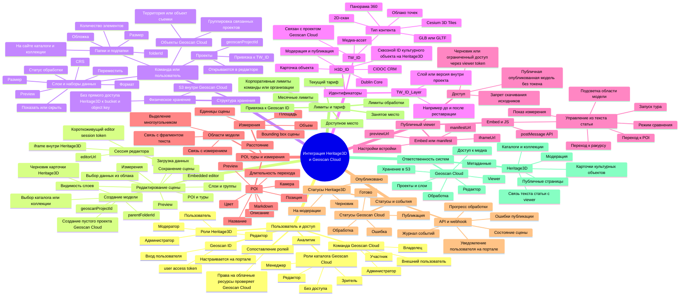

# Geoscan Cloud API для Heritage3D — майнд-карта

```mermaid
mindmap
  root((Интеграция Heritage3D<br/>и Geoscan Cloud))
    Пользователь и доступ
      Geoscan ID
        Вход пользователя
        user access token
      Команда Geoscan Cloud
        Владелец
        Администратор
        Участник
        Внешний пользователь
      Роли каталога Geoscan Cloud
        Менеджер
        Редактор
        Аналитик
        Зритель
        Без доступа
      Роли Heritage3D
        Администратор
        Модератор
        Редактор
        Пользователь
      Сопоставление ролей
        Настраивается на портале
        Права на облачные ресурсы проверяет Geoscan Cloud

    Embedded editor
      Создание модели
        Черновик карточки Heritage3D
        Выбор каталога или коллекции
        parentFolderId
        Создание пустого проекта Geoscan Cloud
        geoscanProjectId
      Сессия редактора
        Короткоживущий editor session token
        editorUrl
        iframe внутри Heritage3D
      Редактирование сцены
        Загрузка данных
        Выбор данных из облака
        Слои и группы
        Видимость слоев
        POI и туры
        Измерения
        Preview
        Сохранение сцены

    Структура хранения
      Физическое хранение
        S3 внутри Geoscan Cloud
        Без прямого доступа Heritage3D к bucket и object key
      Команда или пользователь
        Папки и подпапки
          На сайте каталоги и коллекции
          folderId
          Обложка
          Размер
          Количество элементов
        Объекты Geoscan Cloud
          Группировка связанных проектов
          Территория или объект съемки
        Проекты
          Открываются в редакторе
          geoscanProjectId
          Привязка к TW_ID
        Слои и наборы данных
          Формат
          CRS
          Размер
          Preview
          Статус обработки
          Показать или скрыть
          Переместить

    Идентификаторы
      H3D_ID
        Сквозной ID культурного объекта на Heritage3D
        Карточка объекта
        Dublin Core
        CIDOC CRM
        Модерация и публикация
      TW_ID
        Медиа-ассет
        Связан с проектом Geoscan Cloud
        Тип контента
          Cesium 3D Tiles
          GLB или GLTF
          Облако точек
          2D-скан
          Панорама 360
      TW_ID_Layer
        Слой или версия внутри проекта
        Например до и после реставрации

    Публичный viewer
      Embed или manifest
        iframeUrl
        manifestUrl
        previewUrl
        Настройки встройки
      Доступ
        Публичная опубликованная модель без токена
        Черновик или ограниченный доступ через viewer token
        Запрет скачивания исходников
      Embed и JS
        postMessage API
        Управление из текста статьи
          Переход к POI
          Переход к ракурсу
          Подсветка области модели
          Запуск тура
          Показ измерения
          Режим сравнения

    POI, туры и измерения
      POI
        Название
        Описание
        Markdown
        Цвет
        Позиция
        Камера
        Preview
        Длительность перехода
      Области модели
        Выделение многоугольником
        Связь с фрагментом текста
        Связь с измерением
      Измерения
        Единицы сцены
        Расстояние
        Площадь
        Объем
        Bounding box сцены

    Статусы и события
      Статусы Heritage3D
        Черновик
        На модерации
        Опубликовано
      Статусы Geoscan Cloud
        Обработка
        Готово
        Ошибка
        Публикация
      API и webhook
        Состояние сцены
        Прогресс обработки
        Ошибки публикации
        Журнал событий
        Уведомление пользователя на портале

    Лимиты и тариф
      Привязка к Geoscan ID
      Текущий тариф
      Доступное место
      Занятое место
      Месячные лимиты
      Лимиты обработки
      Корпоративные лимиты команды или организации

    Ответственность систем
      Geoscan Cloud
        Хранение в S3
        Обработка
        Проекты и слои
        Редактор
        Viewer
        Доступ к медиа
      Heritage3D
        Карточки культурных объектов
        Метаданные
        Каталоги и коллекции
        Модерация
        Публичные страницы
        Связь текста статьи с viewer
```
