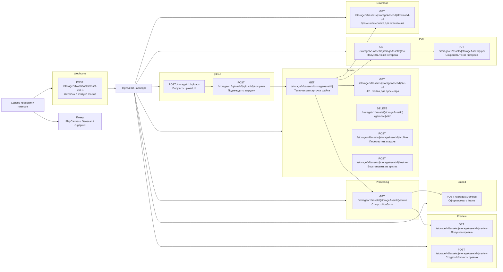

# API сервера хранения и плееров

Эта карта для Obsidian описывает только API сервера хранения и плееров. Здесь нет API портала, карточек культурного объекта, CIDOC CRM, Dublin Core, КАМИС, Госкаталога и ЕГРОКН.

Источник спецификации: `storage-player-openapi.yaml`

Всего endpoints: 15

## Навигация

- [[#Upload]]
- [[#Assets]]
- [[#Processing]]
- [[#Preview]]
- [[#POI]]
- [[#Download]]
- [[#Embed]]
- [[#Webhooks]]
- [[#Параметры embed]]
- [[#PostMessage команды плеера]]
- [[#Что не входит в этот API]]

## Карта endpoints

## Список endpoints

### Upload

| Method | Endpoint | Описание |
|---|---|---|
| `POST` | `/storage/v1/uploads` | Получить временную ссылку для загрузки файла. [details](#post-storagev1uploads) |
| `POST` | `/storage/v1/uploads/{uploadId}/complete` | Подтвердить завершение загрузки. [details](#post-storagev1uploadidcomplete) |

### Assets

| Method | Endpoint | Описание |
|---|---|---|
| `GET` | `/storage/v1/assets/{storageAssetId}` | Получить техническую карточку файла. [details](#get-storagev1assetsstorageassetid) |
| `GET` | `/storage/v1/assets/{storageAssetId}/file-url` | Получить URL файла для просмотра. [details](#get-storagev1assetsstorageassetidfile-url) |
| `DELETE` | `/storage/v1/assets/{storageAssetId}` | Удалить файл или пометить его на удаление. [details](#delete-storagev1assetsstorageassetid) |
| `POST` | `/storage/v1/assets/{storageAssetId}/archive` | Переместить файл в архивный класс хранения. [details](#post-storagev1assetsstorageassetidarchive) |
| `POST` | `/storage/v1/assets/{storageAssetId}/restore` | Восстановить файл из архивного класса хранения. [details](#post-storagev1assetsstorageassetidrestore) |

### Processing

| Method | Endpoint | Описание |
|---|---|---|
| `GET` | `/storage/v1/assets/{storageAssetId}/status` | Получить статус загрузки/обработки файла. [details](#get-storagev1assetsstorageassetidstatus) |

### Preview

| Method | Endpoint | Описание |
|---|---|---|
| `GET` | `/storage/v1/assets/{storageAssetId}/preview` | Получить превью файла. [details](#get-storagev1assetsstorageassetidpreview) |
| `POST` | `/storage/v1/assets/{storageAssetId}/preview` | Создать или обновить превью файла. [details](#post-storagev1assetsstorageassetidpreview) |

### POI

| Method | Endpoint | Описание |
|---|---|---|
| `GET` | `/storage/v1/assets/{storageAssetId}/poi` | Получить точки интереса для PlayCanvas-плеера. [details](#get-storagev1assetsstorageassetidpoi) |
| `PUT` | `/storage/v1/assets/{storageAssetId}/poi` | Сохранить точки интереса для PlayCanvas-плеера. [details](#put-storagev1assetsstorageassetidpoi) |

### Download

| Method | Endpoint | Описание |
|---|---|---|
| `GET` | `/storage/v1/assets/{storageAssetId}/download-url` | Получить временную ссылку для скачивания. [details](#get-storagev1assetsstorageassetiddownload-url) |

### Embed

| Method | Endpoint | Описание |
|---|---|---|
| `POST` | `/storage/v1/embed` | Получить iframe для файла или облачного проекта. [details](#post-storagev1embed) |

### Webhooks

| Method | Endpoint | Описание |
|---|---|---|
| `POST` | `/storage/v1/webhooks/asset-status` | Webhook о статусе файла в сторону портала. [details](#post-storagev1webhooksasset-status) |

## Детали endpoints

### POST /storage/v1/uploads

- Блок: Upload
- Назначение: получить временную ссылку для загрузки файла.
- Auth: `serviceBearerAuth`
- Request schema: `CreateUploadRequest`
- Response: `201 UploadUrlResponse`

### POST /storage/v1/uploads/{uploadId}/complete

- Блок: Upload
- Назначение: подтвердить завершение загрузки.
- Auth: `serviceBearerAuth`
- Path parameter: `uploadId`
- Request schema: `CompleteUploadRequest`
- Response: `201 StorageAsset`

### GET /storage/v1/assets/{storageAssetId}

- Блок: Assets
- Назначение: получить техническую карточку файла.
- Auth: `serviceBearerAuth`
- Path parameter: `storageAssetId`
- Response: `200 StorageAsset`

### DELETE /storage/v1/assets/{storageAssetId}

- Блок: Assets
- Назначение: удалить файл или пометить его на удаление.
- Auth: `serviceBearerAuth`
- Path parameter: `storageAssetId`
- Response: `202 StorageOperation`

### GET /storage/v1/assets/{storageAssetId}/file-url

- Блок: Assets
- Назначение: получить URL файла для просмотра.
- Auth: `serviceBearerAuth`
- Path parameter: `storageAssetId`
- Response: `200 FileUrlResponse`

### POST /storage/v1/assets/{storageAssetId}/archive

- Блок: Assets
- Назначение: переместить файл в архивный класс хранения.
- Auth: `serviceBearerAuth`
- Path parameter: `storageAssetId`
- Response: `202 StorageOperation`

### POST /storage/v1/assets/{storageAssetId}/restore

- Блок: Assets
- Назначение: восстановить файл из архивного класса хранения.
- Auth: `serviceBearerAuth`
- Path parameter: `storageAssetId`
- Request schema: `RestoreArchiveRequest`
- Response: `202 StorageOperation`

### GET /storage/v1/assets/{storageAssetId}/status

- Блок: Processing
- Назначение: получить статус загрузки/обработки файла.
- Auth: `serviceBearerAuth`
- Path parameter: `storageAssetId`
- Response: `200 ProcessingStatus`

### GET /storage/v1/assets/{storageAssetId}/preview

- Блок: Preview
- Назначение: получить превью файла.
- Auth: `serviceBearerAuth`
- Path parameter: `storageAssetId`
- Query parameter: `size`
- Response: `200 PreviewAsset`

### POST /storage/v1/assets/{storageAssetId}/preview

- Блок: Preview
- Назначение: создать или обновить превью файла.
- Auth: `serviceBearerAuth`
- Path parameter: `storageAssetId`
- Request schema: `CreatePreviewRequest`
- Response: `202 StorageOperation`

### GET /storage/v1/assets/{storageAssetId}/poi

- Блок: POI
- Назначение: получить точки интереса для PlayCanvas-плеера.
- Auth: `serviceBearerAuth`
- Path parameter: `storageAssetId`
- Response: `200 PoiListResponse`

### PUT /storage/v1/assets/{storageAssetId}/poi

- Блок: POI
- Назначение: сохранить точки интереса для PlayCanvas-плеера.
- Auth: `serviceBearerAuth`
- Path parameter: `storageAssetId`
- Request schema: `UpdatePoiListRequest`
- Response: `200 PoiListResponse`

### GET /storage/v1/assets/{storageAssetId}/download-url

- Блок: Download
- Назначение: получить временную ссылку для скачивания.
- Auth: `serviceBearerAuth`
- Path parameter: `storageAssetId`
- Response: `200 DownloadUrlResponse`

### POST /storage/v1/embed

- Блок: Embed
- Назначение: получить iframe для файла или облачного проекта.
- Auth: `serviceBearerAuth`
- Request schema: `CreateStorageEmbedRequest`
- Response: `200 StorageEmbedResponse`

### POST /storage/v1/webhooks/asset-status

- Блок: Webhooks
- Назначение: webhook о статусе файла в сторону портала.
- Auth: `webhookSignature`
- Request schema: `AssetStatusWebhook`
- Response: `202`

## Параметры embed

`POST /storage/v1/embed` должен уметь собрать готовый `iframeUrl` и `iframeHtml`.

Для PlayCanvas viewer используются параметры:

| Параметр | Значение | Назначение |
|---|---|---|
| `load` / `assetUrl` | URL файла | Файл модели для загрузки. |
| `embed` | `0` / `1` | Включить iframe-режим. |
| `ui` | `full` / `compact` / `minimal` | Пресет интерфейса. |
| `lang` | `ru` / `en` / `zh` | Язык интерфейса. |
| `autoplay` | `0` / `1` | Запускать сразу или ждать клика. |
| `panel` | `0` / `1` | Показывать боковую панель. |
| `poi` | `0` / `1` | Показывать точки интереса. |
| `tour` | `0` / `1` | Показывать навигацию по точкам. |
| `measure` | `0` / `1` | Разрешить измерения. |
| `info` | `0` / `1` | Показывать информационные элементы. |
| `modelInfo` | `0` / `1` | Показывать техническую информацию о модели. |
| `controls` | `0` / `1` | Показывать кнопки управления. |
| `fullscreen` | `0` / `1` | Разрешить полноэкранный режим. |
| `fit` | `0` / `1` | Показывать кнопку вписать модель. |
| `reset` | `0` / `1` | Показывать кнопку сброса камеры. |
| `cameraPosition` | `x,y,z` | Начальная позиция камеры. |
| `cameraFocus` | `x,y,z` | Начальная точка фокуса камеры. |

## PostMessage команды плеера

Команды от страницы сайта во viewer:

| Command | Описание |
|---|---|
| `focus-poi` | Перейти к точке интереса по `id`. |
| `open-poi` | Открыть точку интереса, сейчас работает как `focus-poi`. |
| `clear-poi` | Снять активную точку. |
| `next-poi` | Перейти к следующей точке. |
| `prev-poi` | Перейти к предыдущей точке. |
| `seek-animation` | Перейти к времени/кадру анимации. |
| `play-animation` | Запустить анимацию. |
| `pause-animation` | Остановить анимацию. |
| `freeze-animation` | Зафиксировать анимацию на времени/кадре. |

События от viewer к странице сайта:

| Event | Описание |
|---|---|
| `poi-selected` | Активирована точка интереса. |
| `poi-cleared` | Активная точка сброшена. |
| `animation-time` | Изменилось время анимации. |

## Что не входит в этот API

- карточка культурного объекта;
- CIDOC CRM;
- Dublin Core;
- КАМИС, Госкаталог, ЕГРОКН;
- каталог сайта;
- портальная модерация;
- пользовательские роли портала;
- выбор активного цифрового двойника.
